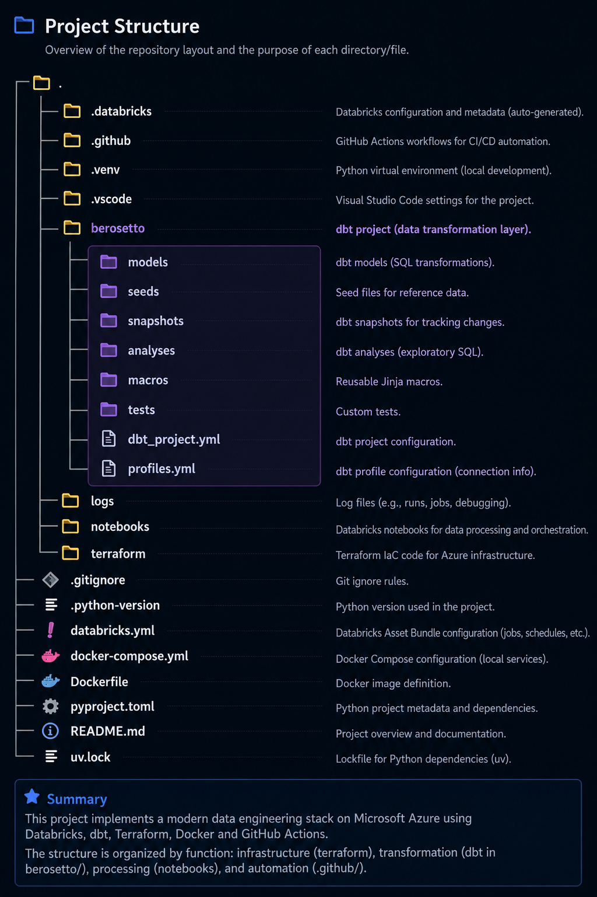

# Berosetto

# Azure Data Engineering Project

This repository contains an ongoing Data Engineering project built on the Microsoft Azure ecosystem. The goal of the project is to design and implement a modern, production-inspired data platform, covering infrastructure provisioning, data ingestion, transformation, orchestration, and CI/CD.

> **Project Status:** 🚧 Work in Progress

## Technologies

- Microsoft Azure
- Azure Databricks
- dbt (Data Build Tool)
- Terraform
- Docker
- GitHub Actions

